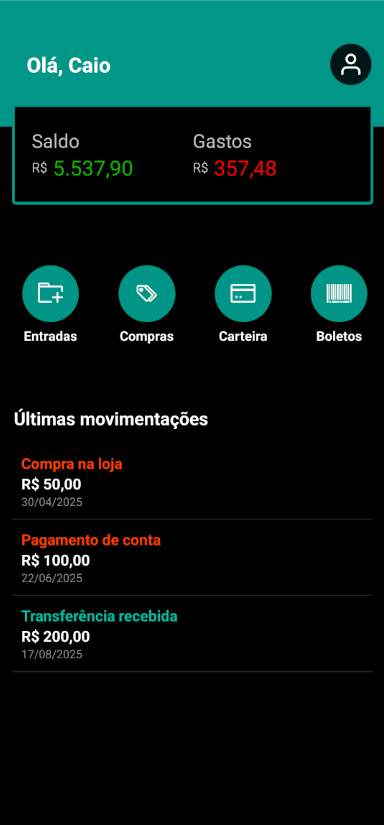

# Finance App Mock

Mock de aplicativo financeiro desenvolvido em React Native com Expo.

Projeto focado em:

- Componentização
- Animações com Moti
- Organização de estrutura
- Tipagem com TypeScript
- Layout mobile

## Tecnologias

- React Native
- Expo
- TypeScript
- Moti

## Objetivo

Este projeto é um mock estático criado para treinar arquitetura de componentes e construção de interfaces mobile.

Não possui backend ou persistência de dados.

## Como rodar

```bash
npm i
npx expo start
```

## Preview


